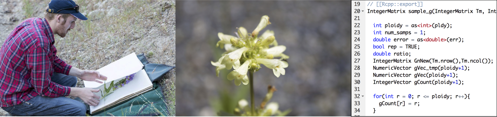

----

Hi! I'm a computational biologist interested in decoding complex genomes through
the development of statistical models, algorithms, and software.
The primary focus of my work to date has been
on building tools to analyze duplicated genomes in polyploids.

I am currently a NSF Postdoctoral Research
Fellow at the University of Arizona working with 
<a href="https://www.barkerlab.net/" target="_blank">Mike Barker</a> 
and <a href="http://gutengroup.mcb.arizona.edu/" target="_blank">Ryan Gutenkunst</a>
to develop novel methods for population genomics in polyploid species.

Prior to this I earned both my BSc (2012 -- Mathematics) and PhD (2018 -- Evolutionary Biology) at
The Ohio State University working with 
<a href="https://wolfelab.wordpress.com/" target="_blank">Andi Wolfe</a> and 
<a href="https://www.asc.ohio-state.edu/kubatko.2/" target="_blank">Laura Kubatko</a>. 
The focus of my research at OSU was on genotype and haplotype inference in polyploids, as
well as hybridization detection and statistical phylogenomics.

To learn more about my <a href="https://pblischak.github.io/research.html">research</a>, 
<a href="https://pblischak.github.io/software.html">software</a>, 
or <a href="https://pblischak.github.io/publications.html">publications</a>, please feel free to take
a look around! If you have questions or would like to get in touch with me, please email
me at paul.blischak@gmail.com, or see the 
<a href="https://pblischak.github.io/contact.html">Contact</a> page for additional details.

----

